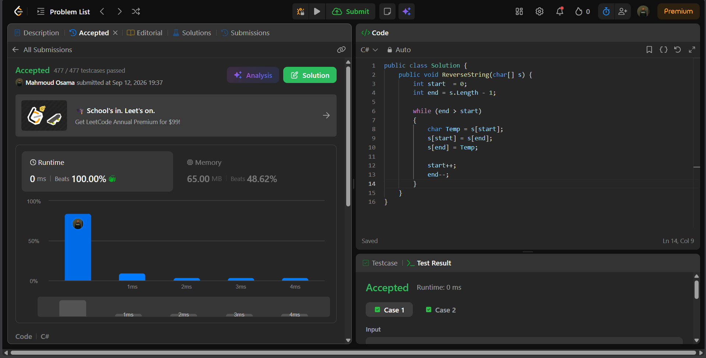

# Leetcode Accout

https://leetcode.com/u/MahmoudOsama777/

Username => MahmoudOsama777

# Acceptance Picture

https://leetcode.com/problems/reverse-string/post-solution/?submissionId=2139787991

# Solution Idea

I have Two Pointer (Start,End)

Start = 0 
End = array length - 1

I make loop while the end bigger than start it run
It swap start and end of array by index

After this Start Increase
And End Descrease

# Complexity

- **Time  Complexity: O(n)**
- **Space Complexity: O(1)**
